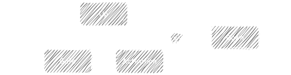
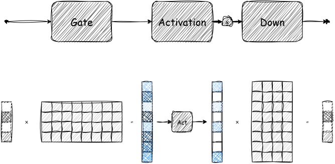
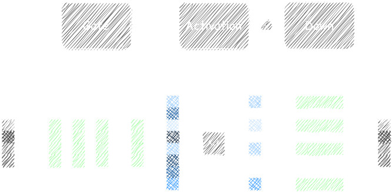
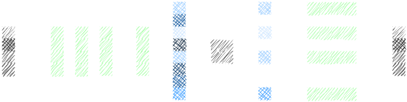

<!-- _paginate: false -->

# Activation Sparsity: A Brief Intro

Mu-Ti Chung

2025.03.02

---

## About Me

- **Name**: Mu-Ti Chung / Muti / 鍾慕提
- **Location**: Taiwan
- **Work**: Software Engineer @ Ambarella
  - Model **compression** & **optimization**

---

## Outline

- Background & Motivation
- Methodology
- Results & Caveats
- Similar Ideas
- Conclusion

---

## Background & Motivation

- Ambarella chips benefit from **unstructured sparsity**.
- LLMs are more challenging to prune & retrain.
- FFN takes up $\sim\frac{2}{3}$ of the weights.

---

<!-- _footer: "* The up projection route is omitted for simplicity." -->

<!--
Now let's zoom in.
Here I have the matrix multiply layouts of the FFN. I also omit the up-projection route for simplicity, but the idea and the conclusion remains basically the same.

* FFN consists of 2 levels: up + down w/ nonlinearity in the middle.
* Older models like OPT use ReLU.
* ReLU introduces sparsity.
-->

---

<!-- _footer: "* The up projection route is omitted for simplicity." -->

<!-- 
* Sparsity => skip corresponding channels w/o hurting accuracy.
* Both directions!
* Up/gate: output channels
* Down: input channels
-->

---

## Methodology

<!-- - How it works.
- Introducing Intrinsic Sparsity
- Inference-Time Exploit
- Analogy to MoE -->

:::: row

::: column

#### Model's Activation Sparsity

- (Older) ReLU models naturally have **activation sparsity**.
- What about newer SiLU ones?

==> **Relufication**!

:::

::: column

#### Inference-Time Exploit

- The FFN structure allows us to **save computation** with **no accuracy impact**.
- How to exploit this at inference time?

==> The **predictor** mechanism!

:::

::::

---

- Title: My Experience and Attempt on Activation Sparsity
- Outline
- Brief self-intro
    - Muti from Taiwan
    - Worked at Ambarella for 4.5 years as a software engineer.
    - Focused on model compression and optimization, e.g. pruning & quantization.
- Background & Motivation
    - Previous Ambarella chips can make use of unstructured weight sparsity.
    - LLMs are more challenging to prune (retraining is resource-intensive)
    - FFN takes up around 2/3 of the computation/IO.
        - We'd like to reduce the IO bandwidth of the FFN module.
- Methodology: Activation Sparsity via ReLU & predictor.
    - How it works.
    - Introducing intrinsic sparsity: Relufication
    - Predictor training
    - Comparison to MoE
- Results & Caveats
- Other things we've tried
    - Q-Sparse
- Similar Ideas
    - Mixture of Experts
    - DeepSeek Sparse Attention
- Conclusion & Future Work
