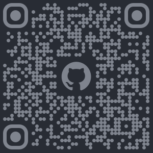
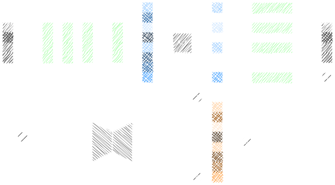
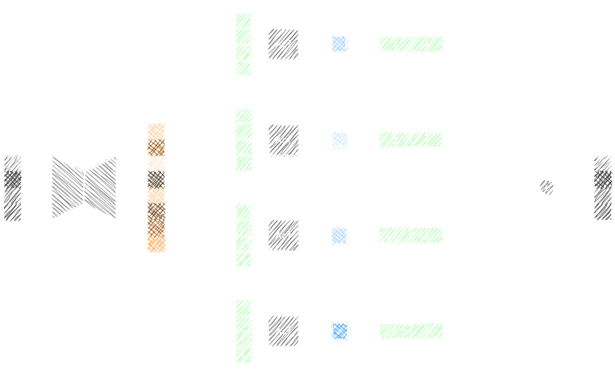

<!-- _paginate: false -->

# Activation Sparsity: A Brief Intro

Mu-Ti Chung

<!-- _footer: "
[](https://mutichung.github.io/activation-sparsity-presentation)

[mutichung.github.io/activation-sparsity-presentation](https://mutichung.github.io/activation-sparsity-presentation)
" -->

<style scoped>
footer {
  position: absolute;
  left: auto;
  text-align: right;
  right: 50px;
  /* height: 400px; */
}
footer a {
  color: var(--comment);
}
</style>

---

## About Me

- **Name**: Mu-Ti Chung / Muti / 鍾慕提
- **Location**: Taiwan
- **Work**: Software Engineer @ Ambarella
  - Model **compression** & **optimization**


---

## Outline

- Background & Motivation
- Methodology
- Results & Observations
- Conclusion & Future Work

---

## Background & Motivation

- Ambarella chips benefit from **unstructured sparsity**.
- LLMs are more challenging to prune & retrain.
- **FFN** takes up $\sim\frac{2}{3}$ of the weights.


---


<!-- _footer: "<sup>*</sup> The up projection route is omitted for simplicity." -->

<!--
Now let's zoom in.
Here I have the matrix multiply layouts of the FFN. Note that I omit the up-projection route for simplicity, but the idea and the conclusion remains basically the same.

* FFN consists of 2 levels: up + down w/ nonlinearity in the middle.
* Older models like OPT use ReLU.
* ReLU introduces sparsity.
-->

---


<!-- _footer: "<sup>*</sup> The up projection route is omitted for simplicity." -->

<!--
* Sparsity => skip corresponding channels w/o hurting accuracy.
* Both directions!
* Up/gate: output channels
* Down: input channels
-->

---

## Methodology


:::: row

::: column

#### Intrinsic Sparsity

- ReLU promotes **activation sparsity**.
- What about newer models with non-ReLU ones?

==> **Relufication**!

:::

::: column

#### Inference-Time Exploit

- The FFN structure allows us to **save computation** with **no accuracy impact**.
- How to exploit this at inference time?

==> The **predictor** mechanism!

:::

::::

---

### Relufication

- Problem: newer models use SiLU.
- Solution:
  1. Replace other activation functions with **ReLU**
  2. **Retrain** <sup>\[1\]</sup>

:::: row

::: column

#### Sparsity

- ReLU variants <sup>\[2\]</sup>
- Progressive sparsity regularization <sup>\[3\]</sup>
- Insert more ReLUs (dReLU) <sup>\[4\]</sup>

:::

::: column

#### Accuracy

- Better data
- Longer training
- Knowledge distillation

:::

::::

<style scoped>
footer {
    font-size: 13px
}
</style>

<!-- _footer: "
[1] Mirzadeh, Iman, et al. \"Relu strikes back: Exploiting activation sparsity in large language models.\"

[2] Zhang, Zhengyan, et al. \"ReLU<sup>2</sup> Wins: Discovering Efficient Activation Functions for Sparse LLMs.\"

[3] Song, Chenyang, et al. \"Prosparse: Introducing and enhancing intrinsic activation sparsity within large language models.\"

[4] Song, Yixin, et al. \"Turbo sparse: Achieving llm sota performance with minimal activated parameters.\"
" -->

---

### Predictor

- Problem: exploit activation sparsity in up/gate projection.
- Solution: add a **predictor** module <sup>\[1,2\]</sup>



<style scoped>
footer {
    font-size: 13px
}
</style>

<!-- _footer: "
[1] Liu, Zichang, et al. \"Deja vu: Contextual sparsity for efficient llms at inference time.\"

[2] Alizadeh, Keivan, et al. \"Llm in a flash: Efficient large language model inference with limited memory.\"
" -->

<!--
- Skipping down projection is rather easy / intuitive, but that's just 1/3 of the weights.
- Take benefit at the front modules.
-->

---

#### Analogy to MoE



<!--
- The former graph can be reorganized into an MoE-like formulation.
- In this case, the predictor acts as the router in the MoE.
- Each expert is a single row/column in up, gate, and down projection weight.
- Difference: topk vs. relu; fixed vs. dynamic sparsity; weighted vs. pure add
-->

---

#### Predictor Training

1. Freeze the model.
2. Inference and cache activations as training dataset.
   - X: input to FFN.
   - Y: input to down projection.
3. Train predictor on (X, Y).

---

<!-- #### Challenges

- Precision vs. recall
  - Focal loss
- Predictor size vs. performance
  - Low-rank adapter
- Intrinsic sparsity $\uparrow$ => difficulty of predictor training $\downarrow$

--- -->

## Results & Observations

::::: matrix

:::: row

::: column

#### Relufication

- **10B**-token budget
- Data, LR, loss

| Llama-2-7b |  Acc | Sparsity |
| ---------- | ---: | -------: |
| ReLU       |  -2% |      67% |
| dReLU      |  -5% |      85% |

- Challenging on newer models

:::

:::column

#### Predictor

- Data: 1M tokens
- Size: ~10% of FFN
- Focal loss
- On **TurboSparse** (dReLU):
  - 99% recall
  - 80% predicted sparsity
    (vs. 90% actual)
  - No accuracy impact

:::

::: column

#### Combined

- Self-trained ReLU-Llama
- Predictor
  - 10% size
  - 98% recall
  - 57% predicted sparsity
  - Another -1% acc drop

<style scoped>
  .column {
    font-size: 20px;
  }
</style>

=> **-3%** acc @ **47%** sparsity

:::

::::

:::::

<!--
To prevent myself from getting into any trouble, allow me to share only the qualitative results.

# Relufication

- 10B = ~1 week for 7B model on 4x H100
- mistral: -7%; qwen2-7b: -10%
-->

---

## Conclusion & Future Work

- **Training-intensive** compression technique
- Inference-time kernel development
- Orthogonality to other optimization tricks
- Similar ideas
  - MoE & Upcycling <sup>\[1\]</sup>
  - Q-Sparse <sup>\[2\]</sup>, TEAL <sup>\[3\]</sup>, CATS <sup>\[4\]</sup>
  - DeepSeek Sparse Attention (DSA) <sup>\[5\]</sup>

<style scoped>
footer {
    font-size: 13px
}
</style>

<!-- _footer: "
[1] He, Ethan, et al. \"Upcycling large language models into mixture of experts.\"

[2] Wang, Hongyu, et al. \"Q-sparse: All large language models can be fully sparsely-activated.\"

[3] Liu, James, et al. \"Training-free activation sparsity in large language models.\"

[4] Lee, Donghyun, et al. \"Cats: Contextually-aware thresholding for sparsity in large language models.\"

[5] DeepSeek-AI. \"Deepseek-v3.2-Exp: Boosting Long-Context Efficiency with DeepSeek Sparse Attention.\"
" -->

<!--
Not a particularly **successful** project :(

-->

---

## References

<style scoped>
ul {
    padding-left: 16px
}
li {
    font-size: 15.5px
}
</style>

- Mirzadeh, Iman, et al. "Relu strikes back: Exploiting activation sparsity in large language models." arXiv preprint arXiv:2310.04564 (2023).
- Zhang, Zhengyan, et al. "ReLU<sup>2</sup> Wins: Discovering Efficient Activation Functions for Sparse LLMs." arXiv preprint arXiv:2402.03804 (2024).
- Song, Chenyang, et al. "Prosparse: Introducing and enhancing intrinsic activation sparsity within large language models." Proceedings of the 31st International Conference on Computational Linguistics. 2025.
- Song, Yixin, et al. "Turbo sparse: Achieving llm sota performance with minimal activated parameters." arXiv preprint arXiv:2406.05955 (2024).
- Liu, Zichang, et al. \"Deja vu: Contextual sparsity for efficient llms at inference time.\" International Conference on Machine Learning. PMLR, 2023.
- Alizadeh, Keivan, et al. "Llm in a flash: Efficient large language model inference with limited memory." Proceedings of the 62nd Annual Meeting of the Association for Computational Linguistics (Volume 1: Long Papers). 2024.
- He, Ethan, et al. \"Upcycling large language models into mixture of experts.\" arXiv preprint arXiv:2410.07524 (2024).
- Wang, Hongyu, et al. \"Q-sparse: All large language models can be fully sparsely-activated." arXiv preprint arXiv:2407.10969 (2024).
- Liu, James, et al. \"Training-free activation sparsity in large language models.\" arXiv preprint arXiv:2408.14690 (2024).
- Lee, Donghyun, et al. \"Cats: Contextually-aware thresholding for sparsity in large language models.\" arXiv preprint arXiv:2404.08763 (2024).
- DeepSeek-AI. \"Deepseek-v3.2-Exp: Boosting Long-Context Efficiency with DeepSeek Sparse Attention.\" GitHub (2025).

---

```python
def goodbye():
    print("Thanks for having me!")
```

<!-- _footer: "
* Created with markdown using [Marp](https://github.com/marp-team/marp).

* Color theme from [onedarkpro.nvim](https://github.com/olimorris/onedarkpro.nvim).

* Fonts by [Maple Mono](https://github.com/subframe7536/maple-font).

* Graphs created with [draw.io](https://draw.io).

* QR-code created with [kozakdenys/qr-code-styling](https://qr-code-styling.com/).

* Crafted by hand with ♥️.
"-->
